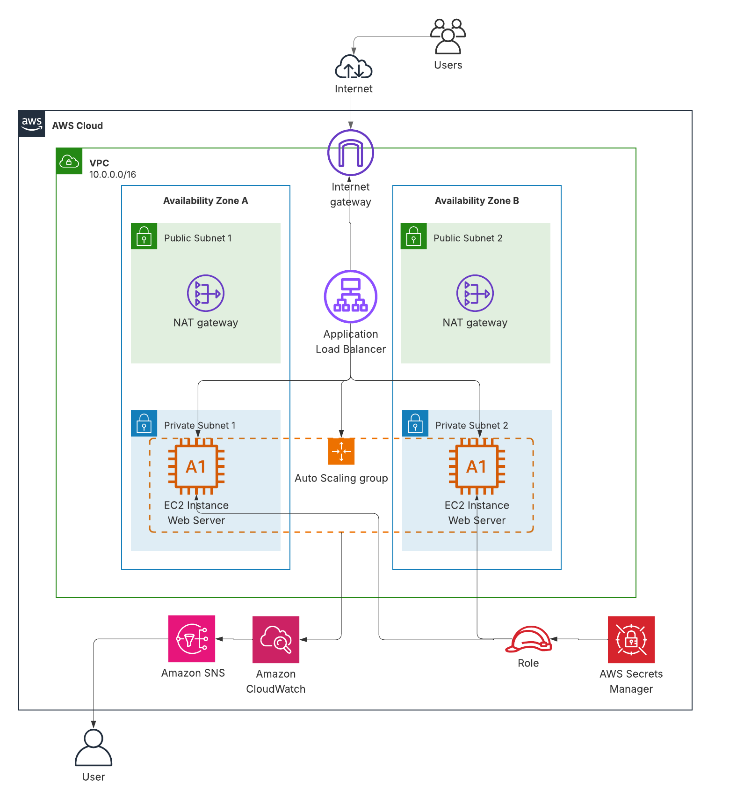
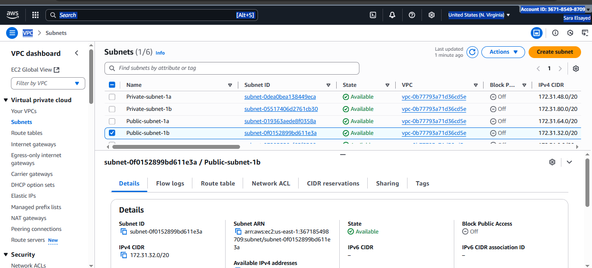
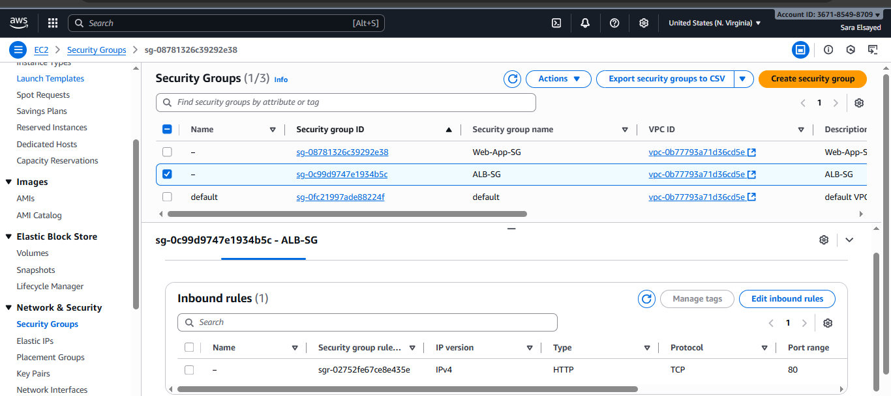
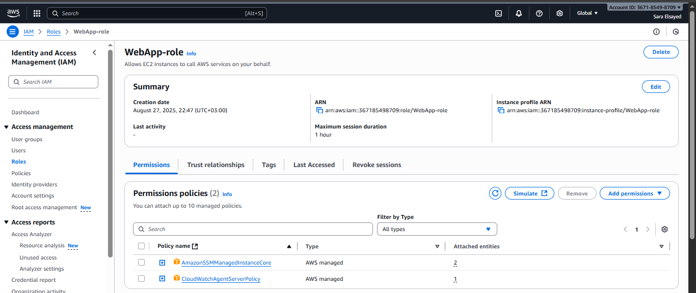
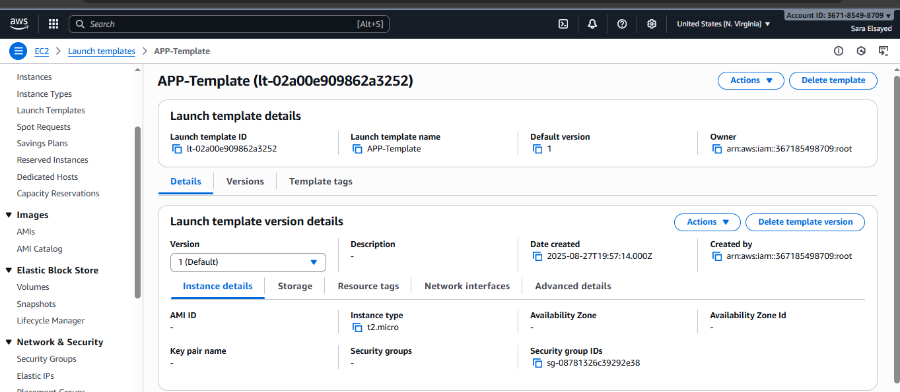
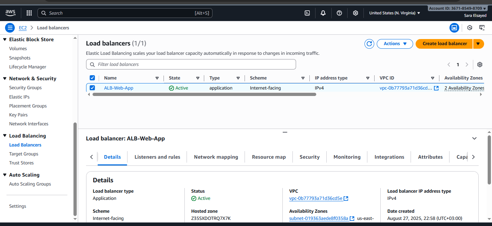
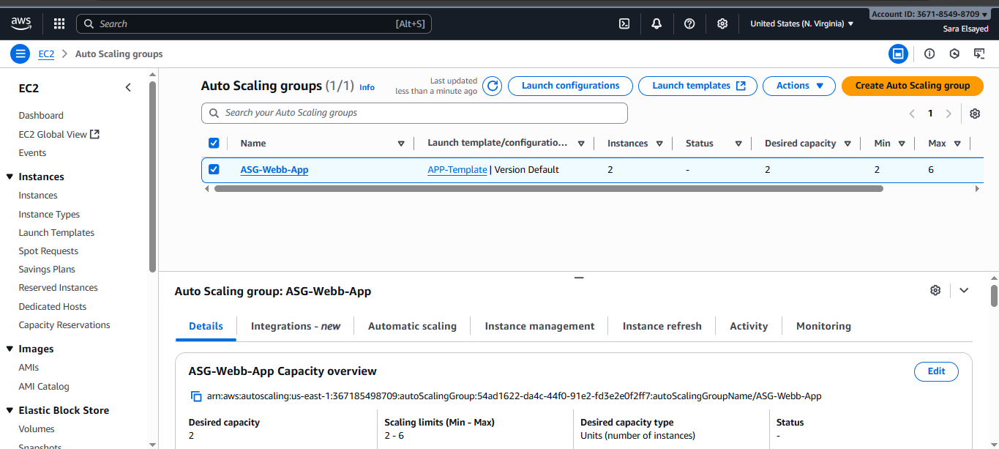
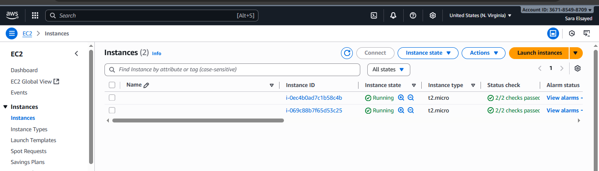
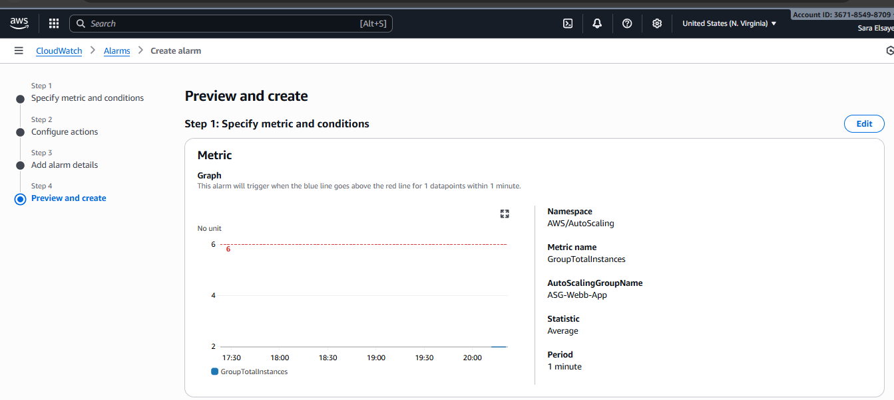

# AWS Web Application 

Deployment of a highly available and scalable web application using AWS core services.  
This setup demonstrates best practices for infrastructure automation, monitoring, and cost efficiency.

---

## Table of Contents
- [Overview](#overview)
- [Architecture](#architecture)
- [Implementation Steps](#implementation-steps)

---

## Overview

This project shows how to deploy a sample web application on AWS with a secure, resilient, and scalable architecture.  
It makes use of Amazon EC2, Application Load Balancer (ALB), Auto Scaling Groups (ASG), IAM, and CloudWatch to ensure performance, reliability, and automation.

---

## Architecture

The application is distributed across multiple Availability Zones.  
Key components include:

- **Application Load Balancer (ALB):** Handles incoming requests and distributes them across healthy EC2 instances.  
- **EC2 Instances in Private Subnets:** Run the application workloads.  
- **Auto Scaling Group (ASG):** Adjusts the number of running instances based on traffic demand.  
- **NAT Gateways & Internet Gateway:** Provide internet access while keeping private resources secure.  
- **IAM Roles & Policies:** Secure access management.  
- **CloudWatch + SNS:** Monitor metrics and send alerts when thresholds are reached.  

---

## Implementation Steps

### 1. Networking
- Create a custom VPC with both public and private subnets across two Availability Zones.  
- Attach an Internet Gateway and configure NAT Gateways for private subnets.  
- Update route tables to handle inbound and outbound traffic properly.  

### 2. Security
- Define security groups for ALB, EC2 instances, and other components.  
- Restrict inbound access to only necessary ports (HTTP/HTTPS).  
- Allow EC2 instances to receive traffic only from the ALB security group.  

- Identify IAM Role for enable SSM and Cloud Watch.

### 3. Launch Template
- Create a launch template with:
  - Amazon Linux 2 AMI  
  - Instance type `t2.micro` (for demo purposes)  
  - Associated IAM Role  
  - User data to install Apache and deploy sample app  

### 4. Load Balancer
- Create an **Application Load Balancer** (internet-facing).  
- Attach it to the public subnets.  
- Create a target group and register EC2 instances automatically through the ASG.  

### 5. Auto Scaling Group
- Use the launch template to create an ASG.  
- Attach the ASG to the target group of the ALB.  
- Configure scaling policies (scale out when CPU > 70%, scale in when CPU < 30%).  

### 6. Monitoring & Alerts
- Enable Amazon CloudWatch metrics for instances and ALB.  
- Create alarms for scaling and error thresholds.  
- Integrate with SNS to send notifications by email when thresholds are breached.  

---

## Learning Outcomes
- How to design a secure and scalable AWS architecture.  
- Implementation of high availability using multi-AZ deployment.  
- Automated scaling of workloads with ASG.  
- Monitoring, alerting, and operational visibility with CloudWatch and SNS.  

---
